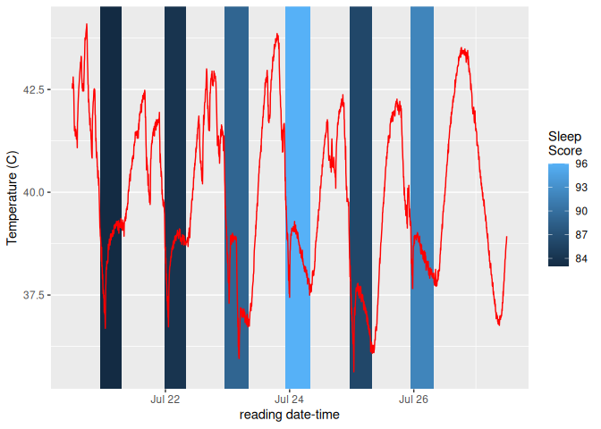
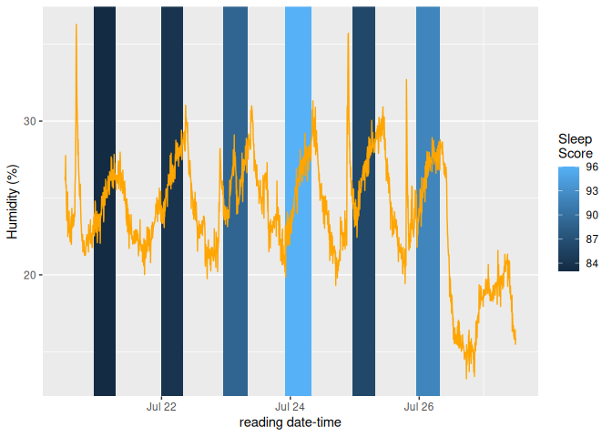
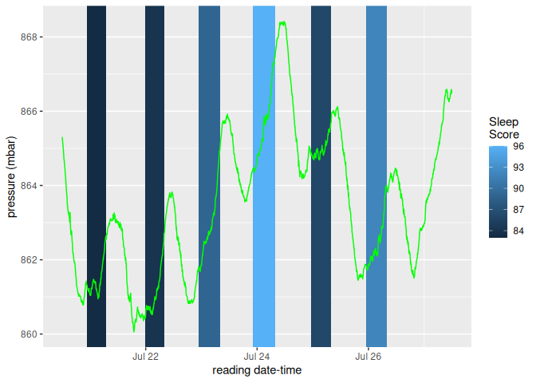

## Jul 28, 2025

The images below below are the combined results of two systems:

- the measurements that I record as part of my [ambience
  database](https://snyderjo.github.io/ambience/), and  
- my sleep patterns as recorded by a wearable device.

My hope is to identify how temperature and humidity affect my sleep, and
adjust them accordingly–god help if pressure affects my sleep.

The line represents the value of the measurement in question. The blue
boxes represent the recorded sleep from beginning to end with the color
representing the sleep score.

For a more interactive and/or exploratory version of this report [click
here](weeklyReport.html)

### Temperature

<!-- -->

Some of you might be asking: *Does it really get above 40 (104 degrees
Fahrenheit) in your bedroom???*  
No. The sensor is attached to a raspberry pi, which produces a good
amount of heat on its own. The above data measures temperature with a
consistent bias.

### Humidity

<!-- -->

### Pressure

<!-- -->

#### A couple of notes:

- What gives with the delay between the date this report is rendered
  vs. what is displayed above?
  - If the data were immediate, it would be entirely too clear when I
    was out of town–information I’m not keen to share.  
- There are notable gaps in data. Why?
  - Some nights, I forget to put on the wearable.  
  - Some days the
    [DAG](https://airflow.apache.org/docs/apache-airflow/1.10.9/concepts.html)
    fails for no discerable reason–you might take it up with Apache.  
  - Sometimes, the device itself simply fails to record. ¯\\\_(ツ)\_/¯
